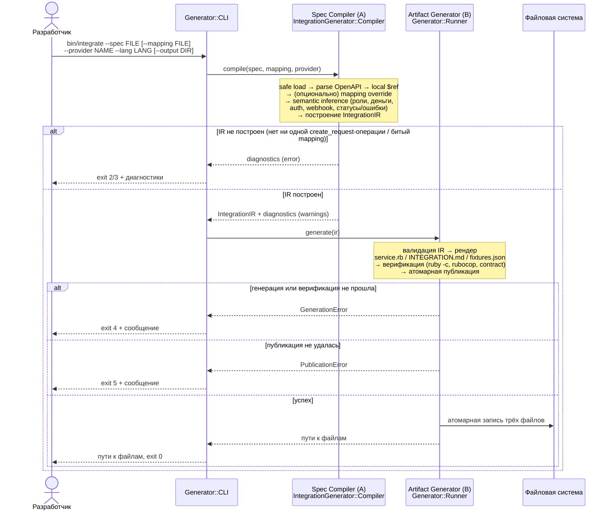

# PayContractIntegrator

Ruby CLI генерирует интеграционные сервисы платёжных провайдеров из provider-neutral `IntegrationIR`.
Проект использует Ruby из `.ruby-version` и не зависит от веб-фреймворка, базы данных или внешнего сервиса.

## Подготовка

Нужен Ruby версии из `.ruby-version` (сейчас `ruby-4.0.6`) и bundler. Если такого окружения нет под рукой, самый надёжный способ — открыть репозиторий в devcontainer (`.devcontainer/`): VS Code / GitHub Codespaces сами поднимут нужную версию Ruby и выполнят `bundle install`.

```bash
bin/setup
```

Без devcontainer `bin/setup` тоже отработает, но только если локальный Ruby совпадает с `.ruby-version` — иначе `bundle install` может подобрать несовместимые версии гемов или упасть.

## Pipeline

`bin/integrate` запускает `MainWorker` с двумя независимыми этапами:

1. parsing — читает CLI/spec/mapping и возвращает immutable IR;
2. generation — создаёт, проверяет и атомарно публикует артефакты.

Parsing реализуется отдельно. Второй этап доступен как `Generator::Runner` и принимает объект с `ir`, `output` и `force`.

Generation использует закрытый `HandlerFactory` и Template Method `BaseHandler`. Результат содержит:

- `<provider>_service.rb` — дочерний класс `Provider::BaseService`;
- `INTEGRATION.md`;
- `fixtures.json`;
- внутренний manifest с версиями и SHA-256.

## Диаграмма последовательности



## Пример запуска

`--mapping` обязателен, но сам файл может быть минимальным — маппинг нужен только для явных переопределений (`platform_source`, `required_if`), которые парсер не может безопасно вывести из спеки:

```bash
echo 'schema_version: "1.0"' > integration_mapping.yml

bin/integrate \
  --spec test/fixtures/integration_generator/providers/provider_api.yaml \
  --mapping integration_mapping.yml \
  --provider novapay \
  --lang ruby
```

Ожидаемый результат:

```text
output/novapay_service.rb
output/INTEGRATION.md
output/fixtures.json
```

Exit code `0` — генерация прошла и артефакты опубликованы. Коды `2`/`3`/`4`/`5` и диагностика в stderr описаны в `lib/generator/cli.rb`.

## Соответствие критериям кейса

| № | Критерий | Где в коде | Комментарий |
|---|---|---|---|
| 1 | Разбор API — методы, параметры запросов/ответов | `lib/integration_generator/open_api_parser.rb` | версия, servers, paths/verbs, parameters, responses |
| 2 | Разбор API — авторизация, статусы операций, ошибки | `lib/integration_generator/auth_resolver.rb`, `status_error_resolver.rb` | auth-схемы, status_map/error_map |
| 3 | Разбор API — webhook и другие условия взаимодействия | `lib/integration_generator/webhook_resolver.rb` | подпись, event_map |
| 4 | Генерация сервиса — формирование и отправка запросов | `lib/generator/handlers/ruby_service_handler.rb`, `field_renderer.rb` | `create_request`, payload строится из `platform_source` |
| 5 | Генерация сервиса — обработка ответов, статусов, ошибок | `ruby_service_handler.rb` (`render_status`, `normalize_response`) | `STATUS_MAP`/`ERROR_MAP` |
| 6 | Генерация сервиса — входящие уведомления, настройка подключения | `ruby_service_handler.rb` (`render_callback`, `verify_webhook_signature!`) | ENV-конфиг, HMAC constant-time compare |
| 7 | Преобразование данных — сопоставление полей запросов/ответов/статусов | `lib/generator/contracts.rb` (`FieldIR#platform_source`), `lib/integration_generator/platform_field_resolver.rb` | id/amount/payout_requisite, requisite_container |
| 8 | Преобразование данных — форматы, обязательные/необязательные поля | `lib/integration_generator/field_resolver.rb`, `lib/generator/platform_source_validator.rb` | required/required_if/nullable |
| 9 | Универсальность — работает с разными спеками | `test/fixtures/integration_generator/providers/*.yaml`, `lib/integration_generator/semantic_resolver.rb` | NovaPay/SumUp/Adyen/PayPal-фикстуры |
| 10 | Универсальность — логика не привязана к провайдеру | `test/services/integration_generator/generator_robustness_test.rb` | тест на отсутствие имён провайдеров в generation-коде |
| 11 | Универсальность — новые правила / необрабатываемые элементы | `integration_mapping.yml` overrides (`required_if`, `platform_source`), `Generator::Diagnostic` | mapping — explicit escape hatch, не хардкод в коде |
| 12 | Понятность использования — однокомандный процесс | `bin/integrate`, `lib/generator/cli.rb` | один вызов, стабильные exit codes 0/2/3/4/5 |
| 13 | Понятность использования — настройка, авторизация | `lib/generator/handlers/guide_handler.rb` → `INTEGRATION.md` | auth, config, mappings, webhook |
| 14 | Понятность использования — результат и ошибки | `lib/generator/contracts.rb` (`Diagnostic`), `cli.rb` (`format_diagnostic`) | severity/code/source_path/hint |
| 15 | Качество реализации — структура и разделение компонентов | `lib/integration_generator/` (Spec Compiler) vs `lib/generator/` (Artifact Generator) | раздельные каталоги, без общих внутренних зависимостей |
| 16 | Качество реализации — обработка ошибок парсинга и генерации | `lib/integration_generator/errors.rb` (`SpecError`), `lib/generator/generation_error.rb`, `publication_error.rb` | единая иерархия ошибок на каждом этапе |

---

Разработано командой **AGL** в рамках хакатона **HACK.GENESIS 2026**.
